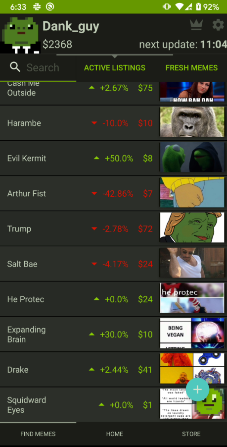
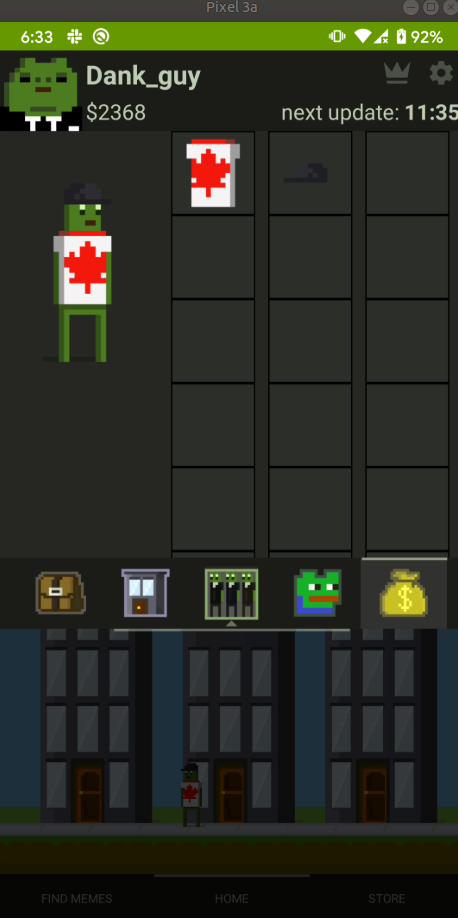

# Memarket

Memarket is a meme-trading app, you can trade meme-stocks with other users in real-time and customize your character and property as you build your portfolio.

Frontend app uses regular Android non-Kotlin Java.
Backend is a PostGreSQL database with simple PHP scripts, and a C++ app to query/store some google-trend meme data. Backend is hosted separately in a private repo.

Animation and media created using aseprite https://www.aseprite.org/

Copyright (c) 2020 Rob Cornall (robthecornall@gmail.com)

 
